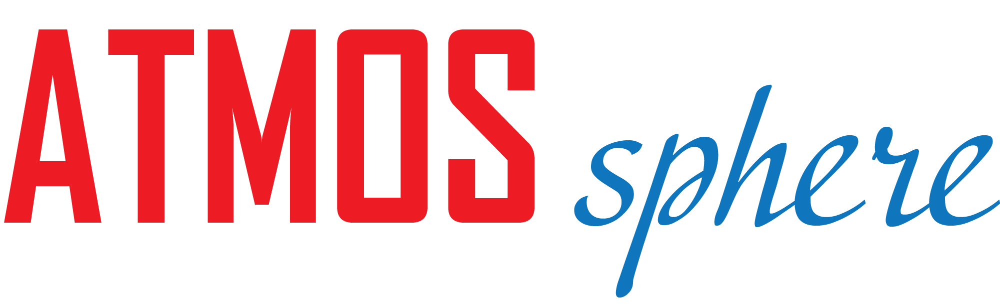

<!-- Headline Logo -->

  

<!-- Tagline: a little explanation about the Godzilla app -->

    <em>ATMOS Sphere: fun, atmospheric, easy to use, open source chat and hang out platform</em>

## Introduction

The unexpected sweep of the COVID-19 pandemic has driven an invisible barrier
between friends, families and loved ones as widely dreaded curfews, quarantines
and other social distancing procedures are slowly integrated into our daily
lives. Subsequently, social gatherings have become a rare luxury, and as social
beings, humanity’s need for basic human interaction grows exponentially as
people spend increasing amounts of time in isolation and loneliness. A need
which if suppressed, may lead to a steady decline in mental health.

## Problem Statement

Based on an [article][1] regarding suicide risk and prevention during the
pandemic , suicide rates during the covid 19 pandemic are expected to rise due
to a decline in mental health cause by fear, self-isolation, and physical
distancing , leading to mental illnesses such as depression, anxiety, and
post-traumatic stress disorder(PTSD).

An application for social interactions in a virtual platform may prove
imperative in improving mental health for its users in not just during the
COVID 19 pandemic, but during regular times as well by providing users with
an option to connect and interact with other humans, preventing more people
from being deprived of their social needs by a virtual form of human
interaction and by doing so elevate moods and potentially distract users from
ssnegative emotions.

## Hypothesis

asd

## Project Description

Project Atmos’ main directive is to provide it’s users with a comfortable,
virtual space to socialize with friends or other Atmos users. This will be
delivered in the form of musical, themed channels called ‘Spheres’, each with
customizable animated backgrounds and music playlist.

A sphere represents a dedicated venue for a group of Atmos users to socialize
in, either via the integrated text chat, voice chat, or video chat channel in a
similar manner to widely used video chatting applications such as discord or
zoom. Each sphere features a customizable animated background, which can be
selected from the default backgrounds, which is a wide plethora of suggested
high-definition backgrounds (e.g., A livestream of Niagara Falls, fishy
aquariums, fireplace, snowy mountains, mystical forest, coffee shop, etc.), and
additional backgrounds added regularly by the dev team. Backgrounds can also be
custom made with the user’s video of choice (provided either by file upload, or
a link to a video such as a YouTube link) using the in-application video editor,
offering basic video editing functions and certain video customization features
such as adding different ambient filters or borders, allowing the user to
produce a looping animated background to suit their desires.

A sphere can be interconnected with a series of different spheres, allowing
spheres of simmilar / relevant themes to exist in close proximity to each other.
Relevant or nearby spheres can appear in as recommedations when in a user sphere,
and are availanle to be visited easily in a graph-node style navigation.

If a user does not wish to go through the process of customizing a sphere and
only wishes to quickly create a session, a “Quick Start” feature will enable a
user to generate a randomized sphere with relevant music genres and themes,
needing the user to only input a music genre of their choice.

In terms of music, full Spotify integration and syncing will also be available
in the Atmos applications, allowing users to select a playlist of their choice
from the Spotify platform which already hosts a multitude of music tracks of
varying genres. However, additional audio effects and filters may be applied in
the Sphere audio settings, adding certain effects such as dampening, echoing,
muffling or even integration with other audio effects (e.g., adding a raining
ambient soundtrack to sad music can create a melancholic atmosphere).

Furthermore, instead of operating as individual sessions for private groups, a
life cycle of a Sphere can be extended as dedicated spheres can be maintained
indefinitely for public joining and use, similar to live stream music channels
on YouTube. Dedicated spheres operate similarly to services such as radio
stations, and are public for all users to join. Owners/Administrators of a
dedicated Sphere may offer a range of content in addition to music streaming,
such as news broadcasting (e.g., the CBC news sphere would be available to the
public to join and view live news being reported), podcasts, or live
performances and concerts, providing the application a secondary function
similar to that of a social media platform.

## System Design

The ATMOS architecture is composed of two parts:

1. Core API
2. Client Apps

The Core API of ATMOS encompasses all the web services for the ATMOS
organization and all the publicly exposed APIs, including the RESTful, GraphQL,
and WebSockets APIs exposed by the core ATMOS services.

The second part of the ATMOS system are the client apps. The offical ATMOS
client will be a JavaScript desktop and browser client application, written
using the React framework along with the Material-UI library.

## Study Design

As per the hypothesis, the idea is that the music, calm background and a
platform for socializing will positively affect a user's mental health. To test
whether such activities in fact have a discernible impact on mental health, we
shall conduct a study involving 70 participants.

The 70 participants will be split in 7 groups of 10 participants each. The
groups will have each be subjected to a different form of activity, and its
impact will be evaluated based on the users' evolution of mood through and at
the end of the activity.

At the beginning of the study, all participants will be given a questionnaire in
order to determine their mental state, and each given a _happiness level_ based
on their results.

The 7 groups will have the following activities they will be a part of:

<!--
- **Group A:** View only the animated background.
- **Group B:** Listen only the _chill beats_ or curated playlist.
- **Group C:** Participate only in the chat along with other users in the group.
- **Group D:** Listen to music, as well as view the animated background.
- **Group E:** View only the animated background, as well as participate in the
  chat.
- **Group F:** Listen to the music, and participate in the chat.
- **Group G:** Listen to the music, participate in the chat as well as view the
  animated background. -->

|         | Animated Background | Chill Beats | Live Chat |
| ------- | :-----------------: | :---------: | :-------: |
| Group 1 |          X          |             |           |
| Group 2 |                     |      X      |           |
| Group 3 |                     |             |     X     |
| Group 4 |          X          |      X      |           |
| Group 5 |                     |      X      |     X     |
| Group 6 |          X          |             |     X     |
| Group 7 |          X          |      X      |     X     |

After the designated acitivity of 30 minute, the moods or _happiness levels_ of
the 70 participants will be evaluated. If our hypothesis is correct, there
should be a statistically significant enhancement of the participants' moods
after the activity, with the highest effect in group G.

## Biggest Risks

### Risk 1: Copyright Strikes

One of the primary features of Atmos is that it is supposed to be a location to
chill and play music. An obvious risk that will arise with this is that if users
can choose what songs they would like in their sphere, they might choose
copyrighted music and backgrounds if they are to choose external music which are
not featured on the spotify platform. This isn't necessarily bad since spheres
aren't monetized, but corporations will still want money for letting people
listen to their music or use their content as backgrounds. There will need to be
ads added somewhere for when copyrighted songs/backgrounds play to appease to
the big corporations. This might be harder to handle for when video chat is
implemented since that will add more legality issues when people start streaming
movies.

### Risk 2: Explicit Content

There is a risk that malicious users may pose a threat which can ruin the experience
for other users through inappropriate content. An example of this maybe be if
spheres with content not suitable of children are created. Atmos will need
clear rules in the terms and conditions stating that either the site cannot be
used for this 18+ content or if explicit content is allowed, then there will
need to be rules on what is acceptable and the restrictions required to ensure
users under the age of 18 do not see this explicit content. Regardless of which
of the 2 rules are chosen, extreme explicit content like real life blood, gore,
and death, as well as illegal pornography like child porn will be banned and
handled with harsher consequences.

### Risk 3: Distribution of Illegal Content

Connecting with the past 2 risks listen above, other illegal content can cause
risks to Atmos. This includes:

- Distribution of pirated games, movies, and other medias or the use of pirated
  media on any sphere.
- Distribution of content that is illegal according to Canadian and
  International Laws or the use of this content on any sphere.
- Distribution of illegal hacking software such as trojans, malware, or other
  viruses that are cybercrimes.

### Risk 4: Distributed Denial of Service (DDoS) Attacks

There might be a possibility that someone might want to take down the Atmos
servers by causing DDoS attacks. This can be devastating and will need to be
handled as soon as possible when it happens since it will cause enough network
trafficking that it'd be impossible for users to use Atmos.

[1]: https://www.thelancet.com/journals/lanpsy/article/PIIS2215-0366(20)30171-1/fulltext
